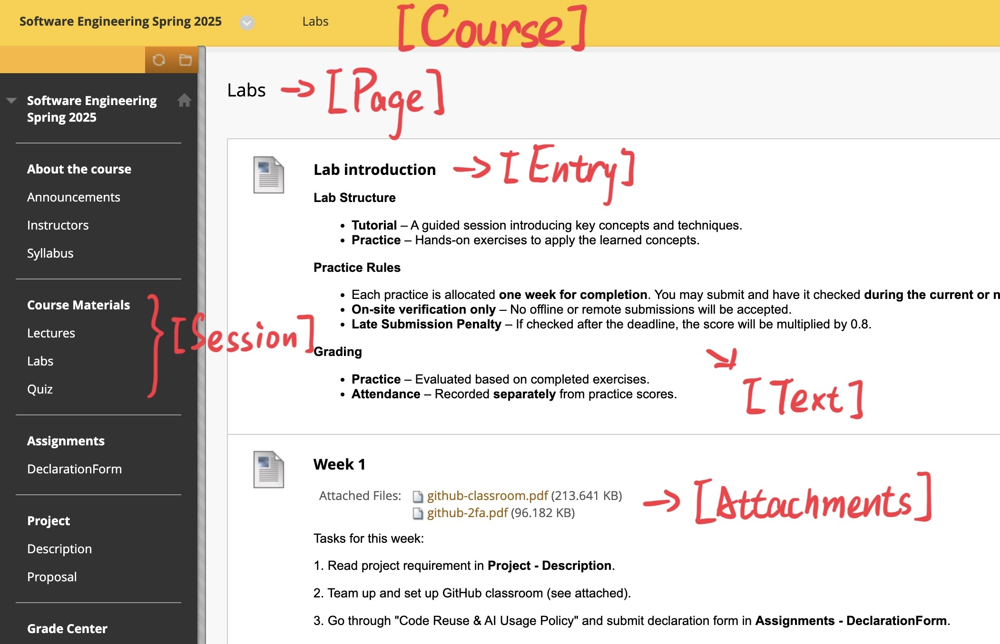

# bb-crawler

  back-end logic implemented by 'python'

## TODO & BUG

### TODO

- [x] crawl the basis file structure & attachments
- [ ] parse announcement
- [ ] submit assignment / quiz interface
- [ ] show grade page

### BUG

- [ ] ???

## GET START

'''
cd bb-crawler
touch login.yaml
echo 'username: <your username>' >> login.yaml
echo 'password: <your password>' >> login.yaml
python crawler.py
'''

## ORGANIZATION

There are the names of each levels' directories

'''
bb-vault
└── term
    └── course
        └── session
            └── page (plain / grade)
                └── entry (plain / announcement / assignment / quiz)
                    ├── attachments
                    └── text
'''
