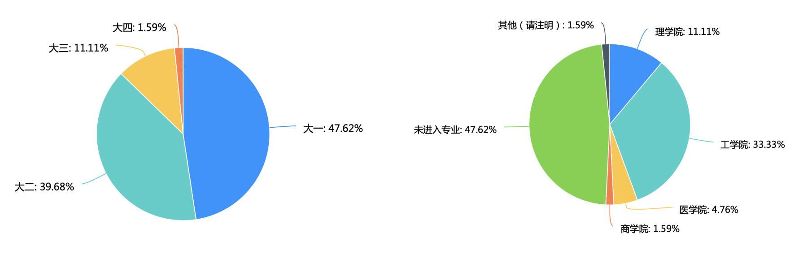
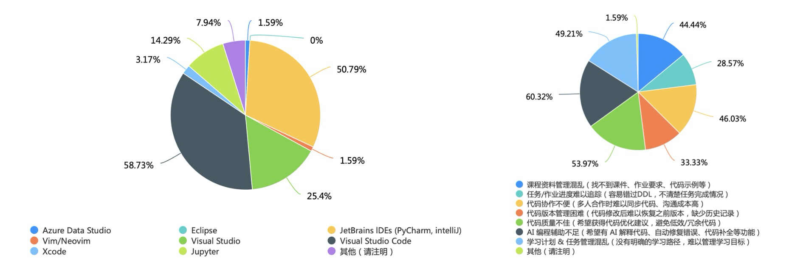
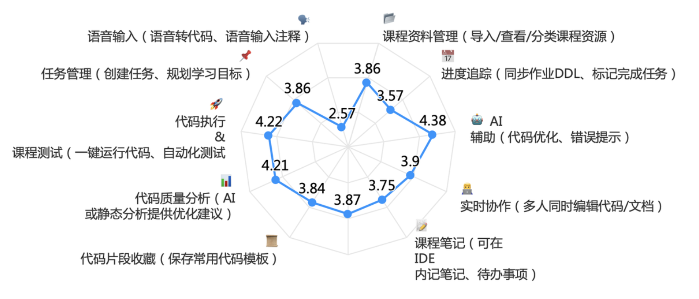
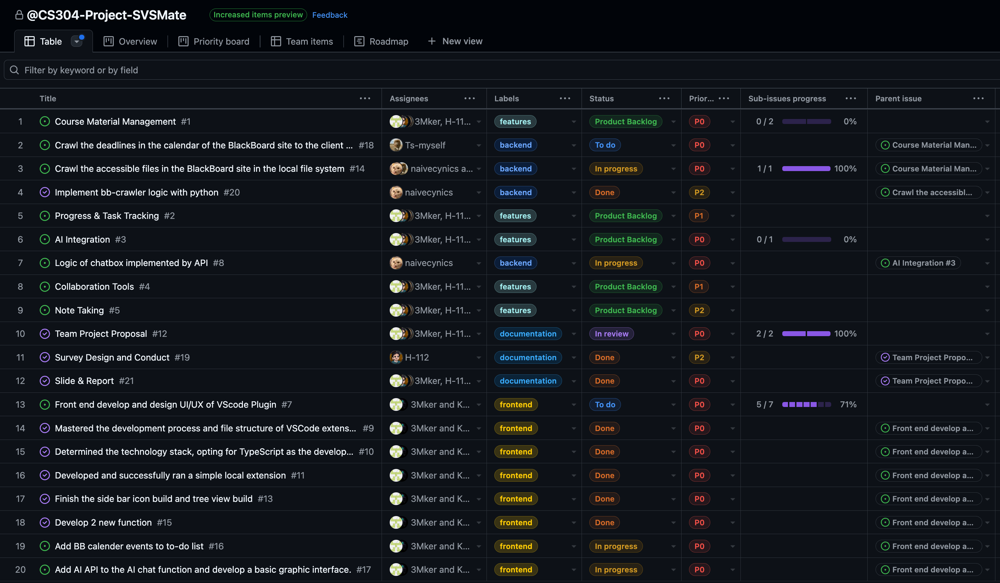

# CS304 Software Engineering Project Proposal

    🚀 SVSMate! – The Ultimate VSCode Extension for SUSTechers 🎯

## 1. **Survey** - User Story

Before developing our VSCode extension, we created a questionnaire and invited potential users to fill it out to collect user stories and determine their needs. Through data analysis, we can better understand user expectations and optimize the extension’s functionality to enhance the user experience.

### Respondent Demographics

The survey respondents are primarily freshmen and sophomores (85%+), with most majoring in engineering or undeclared (80%+), indicating that the plugin’s main users are beginner programmers, especially engineering students.

### Current Tool Usage

Nearly 51% of respondents use Visual Studio Code, making it the most popular development tool, aligning with our target user base for the VSCode extension. Jupyter (25.4%) is also widely used, which can also be integrated in VSCode.

### User Pain Points Analysis

The most significant issue is insufficient AI-assisted coding features (60.32%), indicating a strong demand for intelligent programming aids such as code optimization, error detection, and auto-completion.

Disorganized course materials (53.97%) and difficulty in tracking assignments (46.03%) are also major pain points, highlighting the need for a more effective learning and task management tool.

### Conclusions

1. The primary target users are beginner programmers, especially freshmen and sophomores in engineering disciplines.
    
2. Visual Studio Code is the most commonly used development tool, so the VSCode plugin should prioritize VS Code compatibility.
    
3. Users are most concerned about AI-assisted programming (e.g., code optimization, error detection).
    
4. Task management and progress tracking are essential needs, so the plugin should offer task planning and deadline tracking features.
    
5. Code execution, quality analysis, and testing functionalities are highly demanded and should be prioritized.
    

## 2. **Analysis** - Preliminary Requirement 

From the analysis of the surveys, we listed the tangible and subtle requirements and responding functions in the following four categories.

### Functional requirements

**Course Materials Management**

- Description: This feature enables the seamless import and synchronization of course data. It integrates personal BlackBoard site to replicate and manage the entire file structure. It can automatically and efficiently update the latest course resources. Ideally, we aim to create an efficient learning pipeline that operates independently of the browser.
    

**Progress Tracking & Task Management**

- Description: Users can monitor deadlines, track task progress in a calendar based on information from BlackBoard. Additionally, we provide a local interface for assignment & quiz submissions. Users can also manage todo events manually.
    

**AI Integration**

- Description: Leveraging AI API, the platform offers AI-driven code assistance, breaking down complex project or studying goals, automated course materials reorganization, AI summary document and report generator
    

**Collaboration Tools**

- Description: This feature facilitates real-time collaboration through simultaneous editing of code files, markdown and LaTeX report, integrated chat functionalities, and shared resource management.
    

**Note-Taking**

- Description: An integrated notes app equipped with a To-do list allows users to organize their tasks and keep track of important notes. This ensures that learners and educators alike can maintain clear records of their ongoing projects and assignments.
    

### None-functional requirements

**Usability:**

- The system will feature an intuitive and user-friendly interface that minimizes the learning curve, ensuring smooth navigation across its various functionalities.
    

**Safety & Security:**

- Robust authentication, authorization, and encryption mechanisms will be implemented to safeguard sensitive educational data and protect user privacy.
    

**Performance:**

- Lightweight local caching for faster data access. Reduced network resource utilization for efficient operation. Smart file update strategies. Scalable architecture to maintain performance under varying loads.
    

**Scalability & Reliability:**

- A modular and scalable architecture will support future expansions, additional integrations, and an increasing number of concurrent users without degradation in performance. Adopting a localized operation architecture, reducing reliance on servers to ensure core functionalities remain available even in offline or limited network environments, enhancing system stability and data security.
    

**Maintainability:**

- With clear documentation and a modular codebase, the system will be easier to update and maintain, allowing agile responses to user feedback and emerging requirements.
    

### Data requirements

**Data From BlackBoard:**

- The system requires course materials, structured file data (imported from BlackBoard), custom resource metadata, task and progress logs, code files, and communication logs (from chat functionalities).
    

**Data Acquisition:**

- Data will be imported via APIs from LLM platforms and batch processes from existing educational systems.
    

### Technical requirements

**Operating Environment:**

- The solution will be developed as an extension of Visual Studio Code, which has excellent support across multiple devices, ensuring one version runs on all Windows, MacOS and Linux with required version of VSCode.
    

**Technology Stack:**

- Front-End: Modern TypeScript frameworks for type-safe development, combined with HTML for structure and CSS for styling, enabling the creation of dynamic and responsive user interfaces.
    
- Back-End: A robust server-side framework Node.js to manage application logic and data processing.
    
- AI Modules: API services from Companies (e.g. OpenAI) will be integrated using Node.js to cater the specific requirements like Chat, Code Generation, Task Separation and so on.
    
- Data Management: Multi-tiered storage using VSCode's Memento API for settings/recent chats, OS file systems for bulk data, and SQLite for structured data with attachments — balancing efficiency, cross-platform performance, and scalability.
    

**Integration & Deployment:**

- Continuous integration and deployment (CI/CD) pipelines will be implemented to streamline development workflows. Automated testing and security audits will be part of the deployment process to maintain high standards of quality and reliability.

## 3. **Sprint** - Process & Division of Labor

