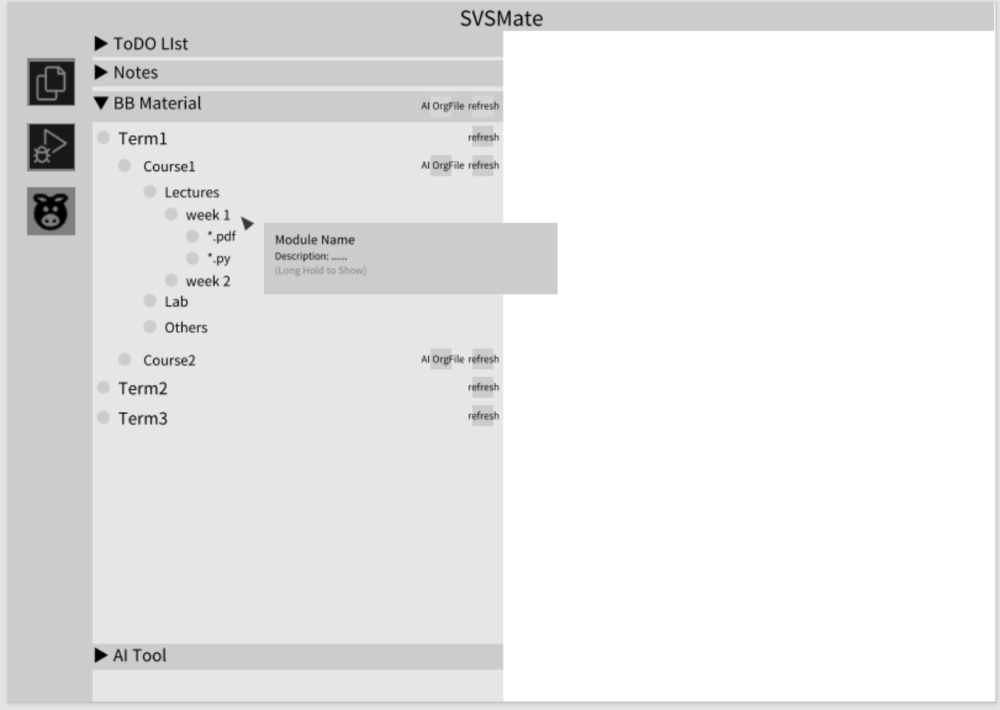
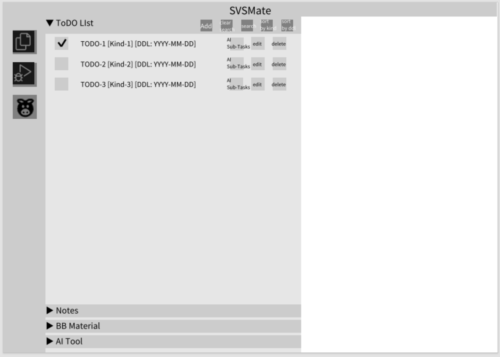
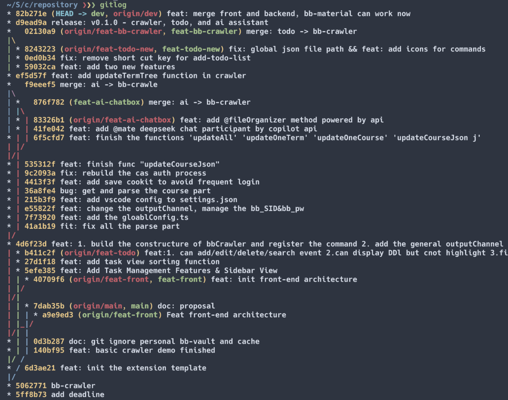
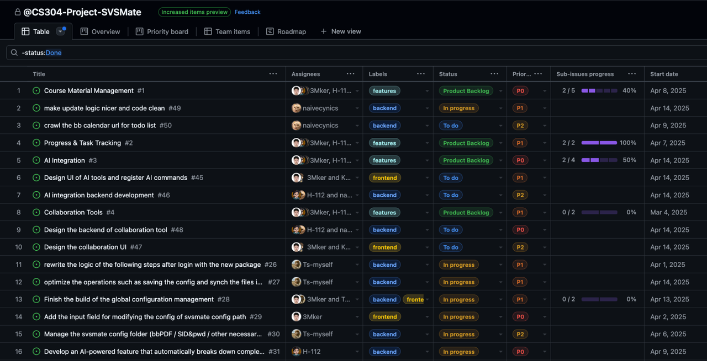
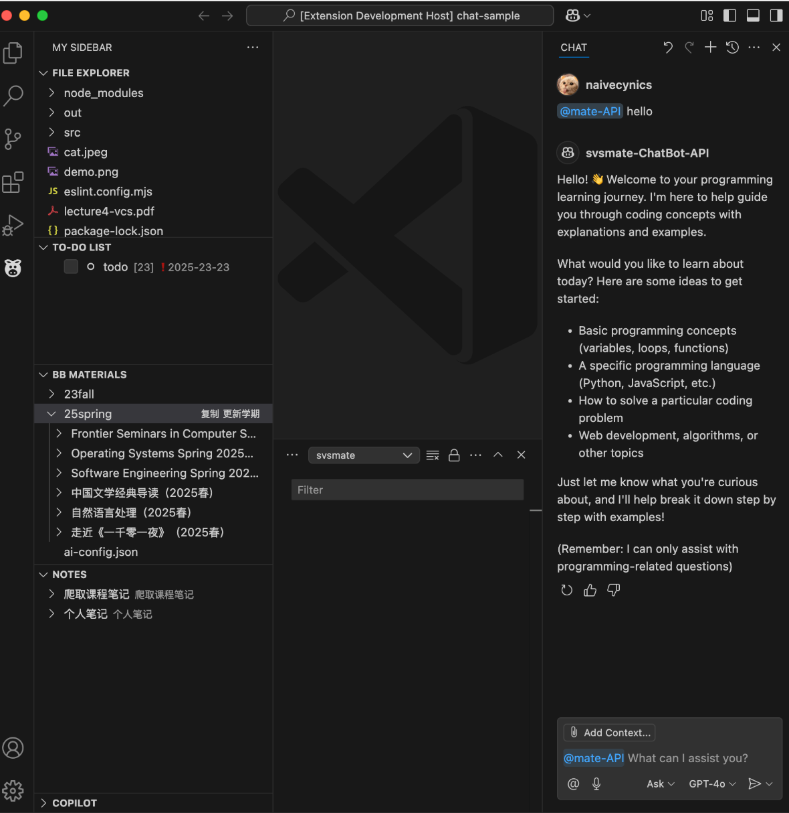

# CS304 Software Engineering Project Sprint1

    🚀 SVSMate! – The Ultimate VSCode Extension for SUSTechers 🎯

## Project Architecture & UI Design

### Architecture Diagram

**Core Modules**

VSCode API acts as the primary interface and runtime for integrating the extension into the VS Code environment.

All major features are implemented as independent modules under the extension runtime:
- bb-crawler: Connects to the Blackboard User Database and fetches course materials using secure credentials and session handling. (completed)
- todo-list: Allows users to manage course-related or personal task lists. (completed)
- note-taking: Enables structured or unstructured note creation linked to specific courses or tasks.
- collaboration-edit: Supports collaborative workflows, such as shared note editing or project tracking.
- ai-integration: Interfaces with an external third-party AI server to provide intelligent features like summarization, chatbot Q&A, and task suggestions. (half completed)
External Systems
- Blackboard User Database: Serves as the official data source for course content and metadata.
- Third-Party AI Server: Provides AI services such as natural language processing and chat capabilities.


**Codebase Organization**

The codebase is structured to reflect a clean separation of concerns:

```
src/
├── extension.ts
├── backend/
│   ├── ai/
│   │   ├── ChatBot.ts
│   │   ├── createChatParticipant.ts
│   │   ├── createChatParticipantAPI.ts
│   │   └── organizerFiles.ts
│   ├── bb/
│   │   └── bbCrawler.ts
├── frontend/
│   ├── bbMaterialView.ts
│   ├── copilotView.ts
│   ├── folderView.ts
│   ├── globalConfig.ts
│   ├── notesView.ts
│   └── todoListView.ts
├── icons/
└── test/
    └── extension.test.ts
```

### UI Design





## Git Log & Github Scrum Board






### Feature Showcase




