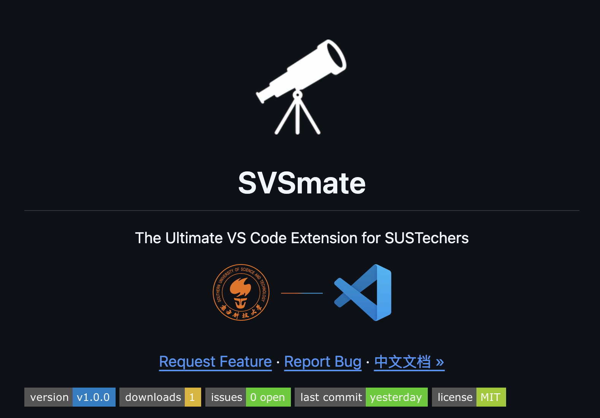
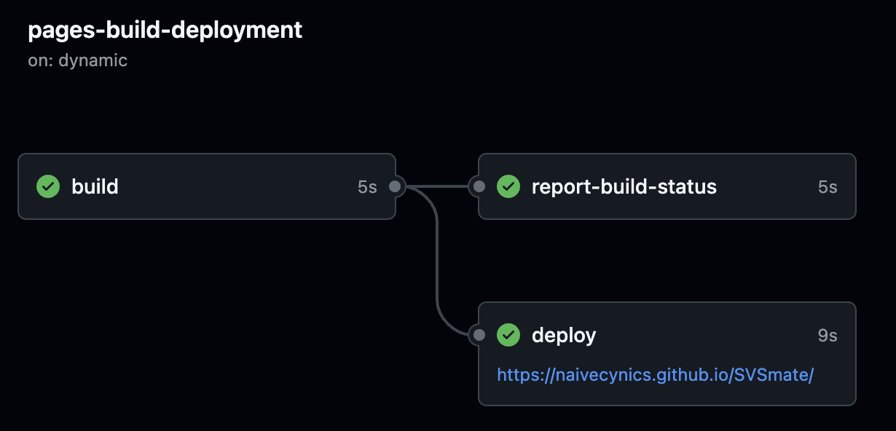

# Final Report for Team 8

> 🚀  Our VS Code extension, SVSmate v1.0.0, is now available on the [VS Code Marketplace](https://marketplace.visualstudio.com/items?itemName=naivecynics.svsmate)!

## Metrics

### Tools & Methodology

* **Lines of Code**: `cloc` with `--by-file`, TypeScript only
* **Cyclomatic Complexity**: `cyclomatic-complexity` NPM tool (filtered via `jq`)
* **Dependencies**: `jq` over `package.json`, filtered for `dependencies` (not `devDependencies`)
* **Source File Count**: Counted `.ts` files via `cloc`

### Metric Values

* **Lines of Code**: 4311
* **Number of Source Files**: 33
* **Number of Dependencies**: 9
* **Total Cyclomatic Complexity**: 730

> Check our [METRICS BASH SCRIPT >>](https://github.com/naivecynics/SVSmate/blob/main/src/test/metrics.sh).

## Documentation

### Documentation for End Users

* Our README is comprehensive and elegantly designed, with a strong visual structure and user-centered layout. 
* It offers clear guidance for installation, usage, and contribution.



> Check our users README in both [GITHUB README >>](https://github.com/naivecynics/SVSmate) and [VSCODE MARKETPLACE >>](https://marketplace.visualstudio.com/items?itemName=naivecynics.svsmate).

### Documentation for Developers


* Generated automatically using `TypeDoc` from inline comments in the TypeScript codebase.

* Continuously maintained and updated via `GitHub Actions` and `CI workflows`.

* Published seamlessly to `GitHub Pages` for developer access.



> Check our developer documentation in [GITHUB PAGES >>](https://naivecynics.github.io/SVSmate/).
>
> Also, [TYPEDOC WORKFLOW >>](https://github.com/naivecynics/SVSmate/blob/main/.github/workflows/typedoc.yml) and [DEPLOYMENT WORKFLOW EXAMPLE>>](https://github.com/naivecynics/SVSmate/actions/runs/15238402395)

## Tests

### Test Pipeline

We used the following tools and frameworks to implement automated testing:

- **Mocha** as the test framework with TDD (`suite`/`test`) structure.
- **@vscode/test-cli** to run integration tests in the VS Code Insiders environment.
- **TypeScript** for writing tests, compiled to JavaScript using `tsc`.
- **glob** for dynamically loading all test files.
- **ESLint** is used during the build step to enforce code quality and consistency.

```
"scripts": {
  "lint": "eslint src --fix",
  "dev:compile": "npx rimraf out && npx tsc -p ./ && npm run lint",
  "test": "vscode-test"
}
```

> **Test entry point**: [`test/index.ts` >>](https://github.com/naivecynics/SVSmate/blob/main/src/test/runTest.ts) 
>
> **VS Code CLI test config**: [`vscode-test.js` >>](https://github.com/naivecynics/SVSmate/blob/main/.vscode-test.js)


### Effectiveness of the Tests

Our tests are highly effective and provide comprehensive coverage of the entire extension. Specifically:

- All features implemented in the project are covered by automated test cases.
- The majority of internal functions and logic components have been verified through well-structured unit tests.
- Integration tests validate the correct behavior of the extension in a simulated VS Code environment.
- The test framework ensures stability and prevents regressions during development.

We are confident that our test suite serves as a strong quality gate, ensuring both correctness and maintainability of the codebase.

```
~/S/c/svsmate ❯❯❯ npm run test   

> svsmate@0.0.1 test
> vscode-test

✔ Validated version: insiders
✔ Found existing install in /Users/naivecynics/SUSTech/cs304-software-engineering/svsmate/.vscode-test/vscode-darwin-arm64-insiders
[main 2025-05-25T15:31:15.032Z] update#setState disabled
[main 2025-05-25T15:31:15.033Z] update#ctor - updates are disabled by the environment

  Todo Commands Test Suite
    ✔ addItem should call addItem with correct parameters
    ...
  pdfutils Test Suit
    ✔ Extract text from PDF pages
    ...
  pathUtil Test Suite
    ✔ safe() replaces illegal characters
    ...
  Path Manager Test Suite
    ✔ initPathManager() sets paths correctly (fallback to ~/.svsmate)
    ...
  Example Test Suite
    ✔ Sample test pipeline pass!
  BlackboardCrawler Test Suite
    ✔ Test svsmate.BB-updateAll Command
    ...
  Todo Commands Test Suite
    ✔ addItem should call addItem with correct parameters
    ...
  suggestTargetPath Test Suit
    ✔ suggestTargetPath can be imported and is a function
  pdfCodeGenerator Test Suit
    ✔ generateCodeFromText can be imported and is a function
  pdfutils Test Suit
    ✔ Extract text from PDF pages
    ...
  pathUtil Test Suite
    ✔ safe() replaces illegal characters
    ...
  Path Manager Test Suite
    ✔ initPathManager() sets paths correctly (fallback to ~/.svsmate)
    ...
  Example Test Suite
    ✔ Sample test pipeline pass!
  createSubtasks Test Suit
    ✔ createSubtasksWithAI can be imported and is a function
  BlackboardCrawler Test Suite
    ✔ Test svsmate.BB-updateAll Command
    ...
  58 passing (57ms)
[main 2025-05-25T15:31:16.269Z] Extension host with pid 25359 exited with code: 0, signal: unknown.
Exit code:   0

```

## Build

### Technologies, Tools and Frameworks

* **Node.js & npm**: Core runtime and package manager
* **TypeScript**: Main language, enabling static typing
* **ESLint**: Code quality enforcement
* **esbuild**: Fast bundling and minification
* **typedoc**: For API documentation generation

### Tasks Executed in a Build

Run the following commands to build the project:

```
npm run package
vsce package
```

### Script Reference

```
"scripts": {
  "compile": "npm run check-types && node esbuild.js",
  "check-types": "tsc --noEmit",
  "watch": "npm-run-all -p watch:*",
  "watch:esbuild": "node esbuild.js --watch",
  "watch:tsc": "tsc --noEmit --watch --project tsconfig.json",
  "vscode:prepublish": "npm run package",
  "package": "npm run check-types && node esbuild.js --product"
}
```

> View [`package.json` >>](https://github.com/naivecynics/SVSmate/blob/main/package.json)


### Final Artifacts

* **Compiled JS Files**: Located in `dist/`
* **Documentation**: Generated via `typedoc`
* **VSIX File**: Packaged extension

## Deployment

### Bundling the Extension

* **esbuild**: Used for bundling source code and dependencies
* **VSCE (vsce)**: Official CLI for packaging the extension into a `.vsix` file

Key configuration:

* `esbuild.js`: Defines entry points, output path, external modules, and build options

### Publishing the Extension

* **VSCE**: Used for publishing the extension to the Visual Studio Code Marketplace
* **GitHub Actions**: Automated deployment pipeline for continuous integration and delivery

By running the following command, we can publish the extension to the marketplace:

```
vsce publish
vsce publish minor // automatically increments the version
```

Our VS Code extension, SVSmate v1.0.0, is now published on the [VS Code Marketplace](https://marketplace.visualstudio.com/items?itemName=naivecynics.svsmate)

Also we can create a release automatically using `GitHub Actions` and `CI workflows`

> Check our [GITHUB WORKFLOW EXAMPLE >>](https://github.com/sustech-cs304/team-project-25spring-8/actions/runs/15238197800)
>
> And auto deployment of release dev version [SVSmate DEV VERSION RELEASE >>](https://github.com/sustech-cs304/team-project-25spring-8/releases)
